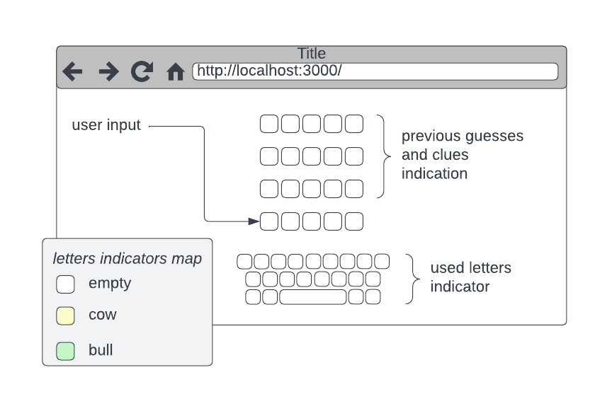

# Final Project

Product Requirement Document (PRD)

- [Overview](#overview)
    - [Wordle Game](#wordle-game)
- [Requirements](#requirements)

## Overview

This document describes a “Wordle” game development in order to participate in a full cycle of web development.

The project was structured to support and guide our web development study path.

### Wordle Game

Wordle is a Bull & Cows style word game. The user is required to guess a randomly selected word in N turns. The
application gets each guess as input and provides clues for the next guess.

An example to a “Wordle” game:

* [Hebrew version - Haaretz](https://www.haaretz.co.il/riddles/ty-page/haaretz-wordle)
* [English version - NYT](https://www.nytimes.com/games/wordle/index.html)

## Requirements

    We use user stories to describe our application requirements. Each user story contains a list of tasks required to complete it.
    There are several ways to write user stories. I chose a template that describes the product from the point of view of a user who tries to use the application.

| Requirement                                                           | Category       |
|-----------------------------------------------------------------------|----------------|
| [Navigating to the page will display a static wordle game](#the-form) | npm, HTML, CSS | 
| [The user should be able to enter a word](#interactions)              | HTML, CSS, JS  | 
| [Reactify](#reactify)                                                 | React          |                                                            

## Features/User Stories

### The Form

Navigating to the page will display a static “Wordle” game.

* [x] Prepare your development environment
* [x] Implement game HTML page (see example below)
* [x] Add style to the page (choose your own)

### Interactions

* [x] After page loaded, the focus should be at the first input
* [x] Allow user to enter single letter:
    - Only letters
    - Move focus to the next input
    - After the last letter show dialog “done”

### Reactify

* [ ] Split the page into components
* [ ] Refactor the page into static React components
    - Consider use the React [tools](https://beta.reactjs.org/learn/start-a-new-react-project)
